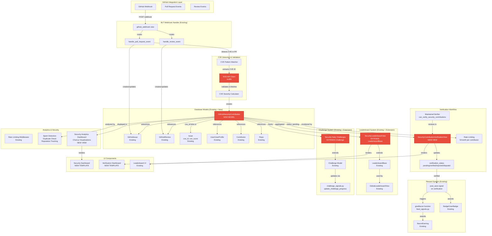
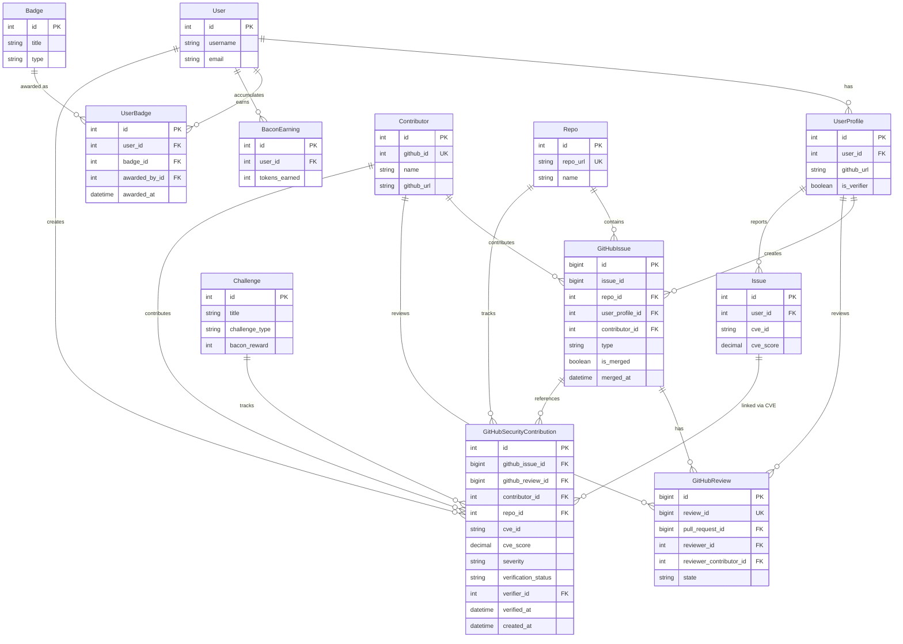
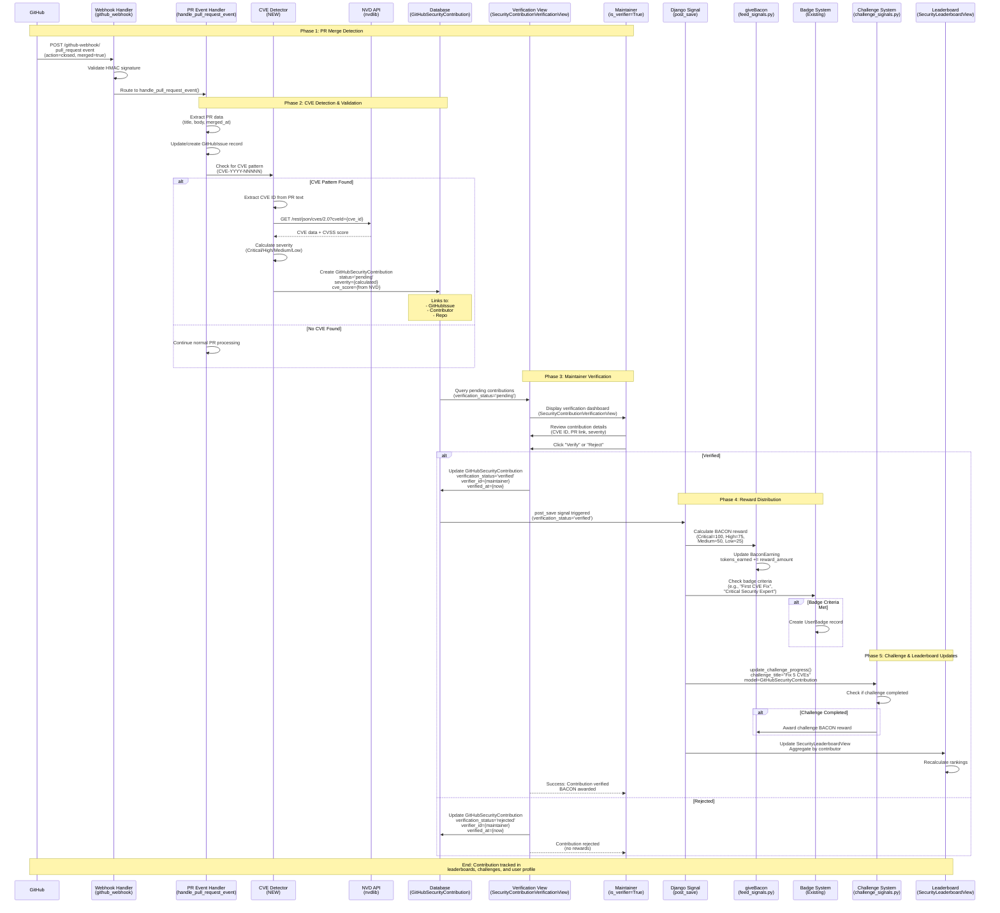

# GitHub Security Contribution Gamification & Recognition Platform - GSoC Proposal

Building on: BLT's existing GitHubIssue/GitHubReview/webhook infrastructure, CVE fields, BACON, badges, and daily challenges work (PR #5245).

**Goal:** Track security-focused GitHub PRs/reviews/issues (especially post-disclosure CVE fixes), link them to existing CVE data via NVD API validation, reward contributors with BACON/badges after maintainer verification, and surface impact-based leaderboards, dashboards, and challenges around security work.

**Post-Disclosure Scope:** This system tracks CVE contributions **after public disclosure** (respects responsible disclosure practices). Cannot track private/embargoed security work due to GitHub API limitations (private advisories deprecated May 2024) and ethical disclosure practices. Most CVE work eventually becomes public, making post-disclosure tracking practical and secure.

---

## System Architecture

### Architecture Diagram



### Database Entity Relationship Diagram



**Note on Field Types:**
- `Contributor.github_id`: Currently `IntegerField` in codebase. Consider migrating to `BigIntegerField` for GitHub IDs > 2^31 (future-proofing).
- `Issue.cve_score`: Currently `max_digits=2` in codebase. Requires migration to `max_digits=3` to support CVSS scores up to 10.0 (see Database Changes section below).

---

## Complete Workflow Sequence

### Main Flow: PR Merge to BACON Award



---

## Integration with Existing BLT Infrastructure

### Key Integration Points

1. **GitHub Webhook System** (`website/views/user.py`)

   - Extends `handle_pull_request_event()` to detect CVE references
   - Extends `handle_review_event()` for review-based contributions
   - No changes to webhook routing or signature validation

2. **Database Models**

   - **New:** `GitHubSecurityContribution` model
   - **Uses:** Existing `GitHubIssue`, `GitHubReview`, `Contributor`, `Repo`, `UserProfile`
   - **Links to:** Existing `Issue` model via `cve_id` field

3. **Reward System** (`website/feed_signals.py`)

   - Uses existing `giveBacon()` function
   - Integrates with existing `BaconEarning` model
   - Extends badge system via `Badge`/`UserBadge` models

4. **Leaderboard System** (`website/views/user.py`)

   - Extends `LeaderboardBase` class (no modifications to base)
   - New `SecurityLeaderboardView` inherits all base functionality
   - Integrates with existing `GlobalLeaderboardView`

5. **Challenge System** (`website/challenge_signals.py`)

   - Uses existing `update_challenge_progress()` function
   - Extends `Challenge` model (no schema changes)
   - Integrates with existing challenge completion flow

6. **Verification System**
   - Uses existing `UserProfile.is_verifier` field
   - New view follows existing BLT view patterns
   - No changes to user permission system

---

## Database Changes Required

### Migration 1: Fix Issue.cve_score Field Constraint

**Current:** `Issue.cve_score = models.DecimalField(max_digits=2, decimal_places=1)`  
**Problem:** Max value is 9.9, but CVSS scores go up to 10.0  
**Fix:** Change to `max_digits=3, decimal_places=1` to support scores 0.0-10.0

```python
# Migration needed in website/migrations/
class Migration(migrations.Migration):
    operations = [
        migrations.AlterField(
            model_name='issue',
            name='cve_score',
            field=models.DecimalField(max_digits=3, decimal_places=1, blank=True, null=True),
        ),
    ]
```

### Migration 2: Contributor.github_id Field Type (Optional)

**Current:** `Contributor.github_id = models.IntegerField()`  
**Note:** GitHub user IDs can exceed 32-bit integer limits (2^31). Consider migrating to `BigIntegerField` if needed for future-proofing, though current IntegerField works for most cases.

---

## Files to Create/Modify

### New Files

1. `website/models.py` - Add `GitHubSecurityContribution` model
2. `website/security_signals.py` - Signal handlers for rewards
3. `website/services/cve_service.py` - NVD API integration
4. `website/views/security.py` - Verification dashboard view
5. `website/templates/security/verification_dashboard.html` - Maintainer UI
6. `website/templates/leaderboard_security.html` - Security leaderboard UI
7. `website/templates/security/dashboard.html` - User-facing dashboard
8. `website/static/js/security-dashboard.js` - Client-side interactions
9. `website/migrations/XXXX_create_github_security_contribution.py` - Database migration

### Modified Files

1. `website/views/user.py` - Extend webhook handlers, add SecurityLeaderboardView
2. `website/challenge_signals.py` - Add security challenge handlers
3. `blt/urls.py` - Add security routes
4. `website/admin.py` - Register new model
5. `blt/settings.py` - Add NVD API config

### Dependencies

```toml
[tool.poetry.dependencies]
nvdlib = "^0.3.0"  # NVD API client
```

---

## Implementation Timeline (~350-370h total)

### Milestone 1: CVE Detection & Tracking 

- Extract CVE IDs from merged PR/issue content using `CVE-\d{4}-\d{4,7}` regex pattern (to be created)
- Create CVE regex pattern utility function
- Link to `Issue.cve_id`, store in new `GitHubSecurityContribution` model
- Wire into `github_webhook` handlers
- Update `handle_pull_request_event()`, `handle_review_event()`, `handle_issue_event()` to detect CVE references
- **Post-disclosure scope:** Track CVE contributions after public disclosure (respects responsible disclosure practices)

### Milestone 2: NVD API Validation & Pre-Screening

- Integrate `nvdlib` (NIST NVD API wrapper) to validate CVE IDs exist
- Fetch severity scores (CRITICAL/HIGH/MEDIUM/LOW) and descriptions
- Pre-screen contributions to block:
  - Fake CVE IDs
  - Documentation-only PRs claiming CVE credit
  - Duplicate submissions
  - Contributors with spam history
- Rate limiting: Max 5 CVE contribution claims per contributor per month (Django cache)

### Milestone 3: Maintainer Verification Workflow 

- Build `SecurityContributionVerificationView` admin dashboard for maintainers
- New model fields: `verification_status`, `verified_by`, `verification_notes`
- Permissions: Add `can_verify_security_contributions` permission
- Dashboard shows: CVE details from NVD, PR diff, contributor history
- Actions: Verify, Reject, Request More Info, Dispute

### Milestone 4: Reward Distribution 

- Use `giveBacon()` from `feed_signals.py` so verified CVE-fix PRs auto-earn BACON
- Scaled by severity: Critical=100, High=75, Medium=50, Low=25
- Security badges via existing `Badge`/`UserBadge` models
- Reward gating: BACON only awarded after maintainer verification (via Django signal)
- Tracks `bacon_awarded` and `bacon_amount` fields

### Milestone 5: Security Leaderboards 

- Build leaderboards extending `LeaderboardBase`
- Rank by impact (`cve_score × contribution count`)
- Separate views for PRs, reviews, and security issues
- Time-period filtering (monthly, yearly, all-time)
- Contributor reputation metrics

### Milestone 6: Security Daily Challenges

- Add GitHub security challenge types to `Challenge.CHALLENGE_TYPE_CHOICES` (depends on PR #5245 being merged first)
- Extend `update_challenge_progress()` to validate via `GitHubSecurityContribution`
- Examples: "Fix a MEDIUM+ CVE this week", "Review 3 security PRs"

### Milestone 7: Security Dashboard UI 

- Create accessible, dark-mode `SecurityContributionDashboardView`
- Shows contributions, badges, verification status, timelines, impact metrics
- Reuse ARIA/dark-mode patterns from PRs #4937 and #5169
- Charts for CVE trends (Chart.js), severity distribution, top contributors

### Milestone 8: Analytics, Tests & Docs 

- `SecurityAnalyticsView` with Django ORM aggregations for CVE fixes over time
- Top contributors/orgs analytics
- End-to-end tests extending `test_github_webhook.py`
- Fraud scenario tests: Fake CVEs, duplicate submissions, trivial PRs, rate limit violations
- Maintainer verification guide
- Contributor CVE claiming guide
- Security audit of verification logic

---

## Security & Fraud Prevention

1. **Rate Limiting**

   - Uses existing middleware (`blt/middleware/throttling.py`)
   - Prevents spam contribution creation

2. **Verification Requirement**

   - All contributions require maintainer verification
   - No automatic rewards without verification

3. **CVE Validation**

   - NVD API validates CVE IDs
   - Invalid CVEs marked as 'Unknown' severity
   - Maintainer can override during verification

4. **Audit Trail**
   - Tracks verifier and verification timestamp
   - Rejection reasons stored
   - All changes logged

---

## Success Criteria

1. CVE detection works for merged PRs
2. NVD API integration validates CVEs
3. Maintainer verification workflow functional
4. BACON rewards awarded correctly (Critical=100, High=75, Medium=50, Low=25)
5. Badges awarded for milestones
6. Security leaderboard displays correctly
7. Challenges track security contributions
8. Fraud prevention measures effective
9. Performance acceptable (<500ms for verification)
10. Documentation complete

---

## Scope & Limitations

### What This Tracks

- Publicly disclosed CVE fixes (post-disclosure only)
- Merged PRs with CVE references
- Published GitHub Security Advisories
- Security reviews and security-labeled issues
- Security-labeled PRs (if GitHub provides labels)

### What This Doesn't Track 

-  Private/embargoed CVE work (respects responsible disclosure)
-  Unpublished security advisories
-  Pre-disclosure contributions

**Why Post-Disclosure?**

- **Ethical:** Respects responsible disclosure practices
- **Secure:** No premature vulnerability leaks
- **Practical:** Most CVE work eventually becomes public
- **API Limitation:** GitHub deprecated private advisory access (May 2024)

## Data Flow Summary

```
GitHub PR Merge (with CVE reference)
    ↓
Webhook Handler (detects CVE pattern)
    ↓
Pre-Screening:
  - Check rate limit (5/month)
  - Check duplicate submission
  - Check spam history
    ↓
CVE Service (validates via NVD API)
    ↓
Create GitHubSecurityContribution (status='pending')
    ↓
Verification Dashboard (maintainer reviews)
  - Shows CVE details from NVD
  - Shows PR diff
  - Shows contributor history
    ↓
Update status to 'verified' (or 'rejected'/'disputed')
    ↓
Django Signal triggers (only if verified)
    ↓
giveBacon() awards tokens (Critical=100, High=75, Medium=50, Low=25)
    ↓
Badge system awards badges
    ↓
Challenge system updates progress
    ↓
Leaderboard updates rankings
```

---

## UI/UX Considerations

- Uses Tailwind CSS (existing BLT standard)
- Brand color: `#e74c3c` (red)
- Responsive design with dark-mode support
- Real-time updates via AJAX
- Clear verification workflow
- User-friendly error messages
- Chart.js visualizations for CVE trends, severity distribution
- Accessible design (ARIA patterns from PRs #4937 and #5169)
- Security dashboard shows:
  - Contributions timeline
  - Badges earned
  - Verification status
  - Impact metrics
  - CVE trends charts
  - Top contributors visualization

---

## Bonus: MY-GSOC-TOOL Integration

Since we're tracking security contribution data, it could connect to MY-GSOC-TOOL, so students could showcase security PRs in GSoC portfolios. Not part of core scope, but easy to add a REST API endpoint later.

## Related Work

- **PR #5057:** CVE Search, Filtering, Caching, Autocomplete (Open) 
- **PR #5245:** Daily Challenges with 24-Hour Reset (Open) 
- **PR #5371:** Security Headers & CSRF (Open) 
- **PR #5351:** Session Security, Rate Limiting (Open) 

**Note:** This proposal builds entirely on top of existing BLT infrastructure. No existing features are replaced or removed. All new functionality integrates seamlessly with current systems including GitHub webhooks, BACON rewards, badges, challenges, and leaderboards.
